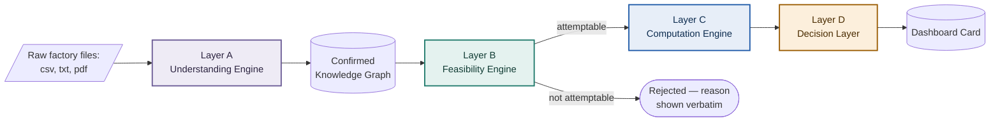
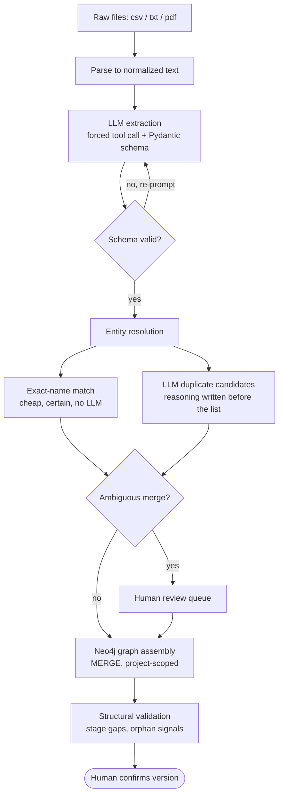
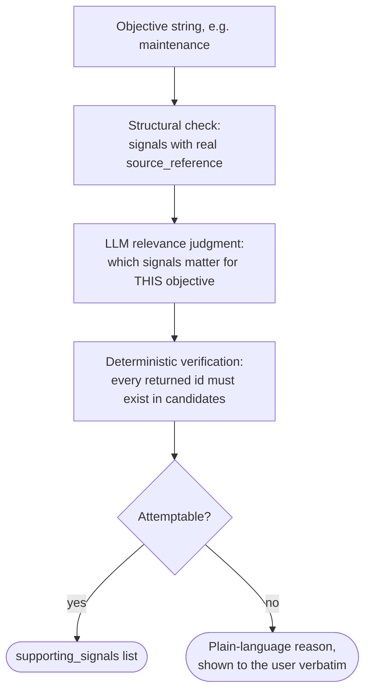
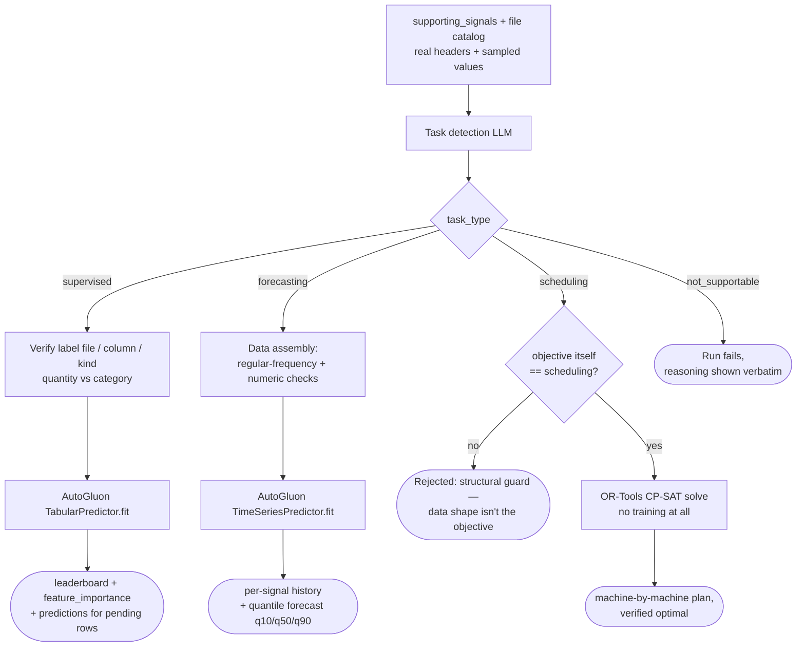
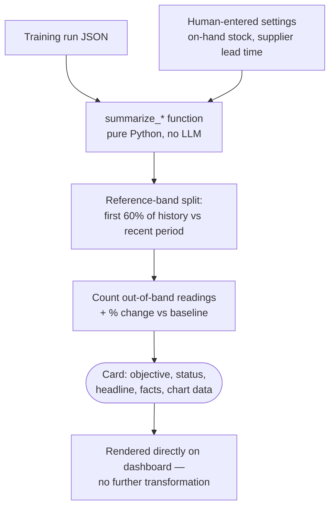
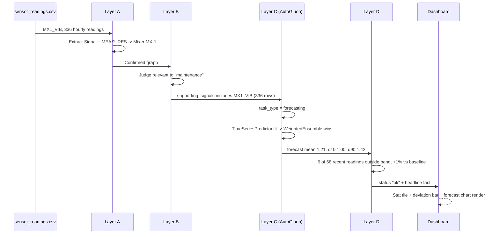

# Kinesis — System Architecture

Open this file in VS Code and use your Mermaid preview extension (right-click inside any
```mermaid``` block → "Open Preview", or `Ctrl+Shift+V` for the full markdown preview) to
render each diagram below.

Four gated layers. Nothing hardcoded, nothing fabricated — every LLM judgment is
deterministically re-verified before it's trusted, and every business objective is gated by
the one before it (a file isn't usable until a human confirms the graph; an objective isn't
trainable until Feasibility confirms real data supports it).

---

## 1. Pipeline overview



---

## 2. Layer A — Understanding Engine

Raw documents → a confirmed, versioned knowledge graph. No per-industry or per-client code —
the same pipeline runs whether the source is a steel plant or a bottling line.



**Real bug this caught:** the duplicate-candidate LLM call returned zero pairs for five genuine
duplicates (`MX1_VIB` vs. `"Mixer MX-1 condition-monitoring vibration"` — same sensor, two
names) because the response schema had no `reasoning` field ahead of the `pairs` list. Moving
`reasoning` to the first field — forcing the exhaustive comparison to be written down before the
list is closed — took the same inputs from 0 pairs to the correct 5.

---

## 3. Layer B — Feasibility Engine

One function decides relevance for every objective, on every dataset — no per-objective code.



---

## 4. Layer C — Computation Engine

Decides *what kind* of model the data supports, then hands modeling entirely to AutoGluon or
OR-Tools — this layer shapes inputs and reports outputs, never hand-rolls a model.



**Real output for "maintenance"** (`task_type: forecasting`, `shortest_series_length: 336`):

| Model | WQL score | Fit time | Predict time |
|---|---|---|---|
| **WeightedEnsemble** ← selected | −0.0328 | 1.16s | 7.39s |
| ETS | −0.0328 | 0.02s | 6.77s |
| Chronos2 | −0.0399 | 17.25s | 0.61s |
| Theta | −0.0484 | 0.05s | 0.10s |
| SeasonalNaive | −0.0598 | 0.03s | 17.5s |

---

## 5. Layer D — Decision Layer

Pure, deterministic Python — **no LLM call happens here.** Every sentence a business user reads
is arithmetic over numbers Layer C already computed.



**Real card produced** (status `watch`, headline *"3 of 4 machines have drifted from their
normal range."*):

| Signal | Status | Outside normal | Learned normal range | vs. baseline |
|---|---|---|---|---|
| LB3_VIB | Watch | 57 / 68 | 1.38 – 1.85 | +25%, climbing |
| FL4_VIB | Watch | 50 / 68 | 1.25 – 1.79 | +24%, climbing |
| CP2_VIB | Watch | 18 / 68 | 1.14 – 1.54 | −1% |
| MX1_VIB | OK | 9 / 68 | 1.00 – 1.42 | +1% |

---

## 6. End-to-end trace — one real signal through all four layers

`MX1_VIB`, the vibration reading on Mixer MX-1, moving through the entire pipeline exactly as
it happened for this run.



---

## Guardrails enforced structurally (not just documented)

- **Verify every LLM decision** — a named label column, a chosen signal id, a proposed duplicate:
  all re-checked deterministically against real data before use.
- **Reasoning-first schemas** — structured-output models fill fields in declaration order, so every
  decision schema puts `reasoning` before the decision fields it leads to.
- **B gates C** — Computation never runs for an objective Feasibility hasn't confirmed attemptable.
- **Human-in-the-loop, always** — ambiguous merges, structural gaps, orphan signals are queued for a
  person, never auto-resolved.
- **Immutable graph versions** — training only ever runs against a confirmed version.
- **Zero hardcoded thresholds** — "normal" is always a signal's own learned quantile band, never a
  fixed number reused across clients or industries.
